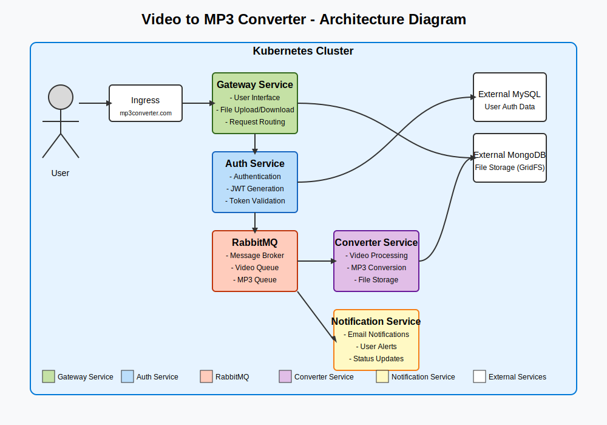
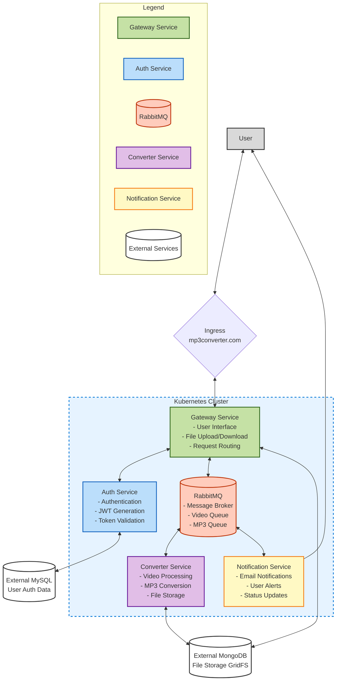
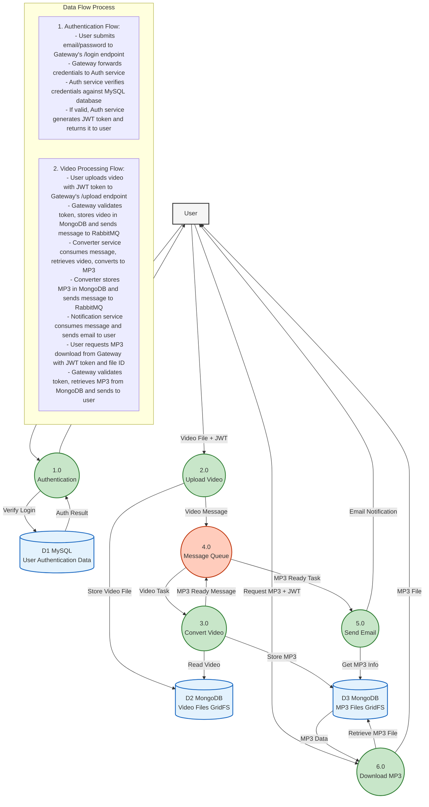

# Video to MP3 Converter - Microservice Architecture

## Overview

This project is a scalable, microservices-based application that converts video files to MP3 audio format. It demonstrates modern cloud-native architecture principles using Python, Kubernetes, RabbitMQ, MongoDB, and MySQL. The system is designed to handle asynchronous video processing in a distributed manner with proper authentication, notifications, and file management.

## Architecture

<!--  -->




The application is composed of several microservices:

1. **Auth Service**: Handles user authentication and JWT token generation/validation
2. **Gateway Service**: Entry point for all client requests, manages file uploads/downloads
3. **Converter Service**: Processes videos and converts them to MP3 format
4. **Notification Service**: Sends email notifications when conversions are complete
5. **RabbitMQ**: Message broker for asynchronous communication between services
6. **MongoDB**: Stores video and MP3 files using GridFS
7. **MySQL**: Stores user authentication information

## Service Communication Flow

1. User authenticates via the Gateway service
2. Upon successful authentication, the user receives a JWT token
3. User uploads a video file through the Gateway service
4. Gateway validates the JWT token and stores the video in MongoDB
5. Gateway sends a message to RabbitMQ's video queue
6. Converter service consumes the message, processes the video, and creates an MP3 file
7. Converter stores the MP3 in MongoDB and sends a message to RabbitMQ's MP3 queue
8. Notification service consumes the message and sends an email to the user
9. User can download the MP3 file through the Gateway service

## Services Breakdown

### Auth Service

- **Purpose**: Manage user authentication and authorization
- **Endpoints**:
  - `POST /login`: Authenticates users and generates JWT tokens
  - `POST /validate`: Validates JWT tokens
- **Database**: MySQL
- **Technologies**: Flask, JWT, MySQL

### Gateway Service

- **Purpose**: API gateway for client applications, handling file uploads/downloads
- **Endpoints**:
  - `POST /login`: Proxies authentication requests to Auth service
  - `POST /upload`: Accepts video uploads, stores in MongoDB, enqueues processing
  - `GET /download`: Streams MP3 files to clients
- **Storage**: MongoDB (GridFS for file storage)
- **Technologies**: Flask, PyMongo, RabbitMQ

### Converter Service

- **Purpose**: Consumes video processing tasks and converts videos to MP3
- **Process**:
  - Listens to the video queue in RabbitMQ
  - Retrieves video from MongoDB
  - Converts video to MP3 using MoviePy
  - Stores MP3 in MongoDB
  - Sends a message to the MP3 queue
- **Technologies**: Pika, PyMongo, MoviePy

### Notification Service

- **Purpose**: Notifies users when their MP3 is ready for download
- **Process**:
  - Listens to the MP3 queue in RabbitMQ
  - Sends email notifications to users
- **Technologies**: Pika, SMTP

### Data Flow


### Infrastructure Components

#### RabbitMQ

- **Purpose**: Message broker for asynchronous communication
- **Queues**:
  - `video`: For video conversion requests
  - `mp3`: For MP3 ready notifications
- **Deployment**: StatefulSet in Kubernetes with persistent storage

#### MongoDB

- **Purpose**: Store video and MP3 files
- **Collections**:
  - `videos.files` & `videos.chunks`: Store uploaded videos using GridFS
  - `mp3s.files` & `mp3s.chunks`: Store converted MP3 files using GridFS
- **Note**: External MongoDB instance   (host.minikube.internal:27017)

#### MySQL

- **Purpose**: Store user authentication data
- **Tables**:
  - `user`: Contains user email and password
- **Note**: External MySQL instance   (host.minikube.internal:3306)

## Kubernetes Deployment

All services are containerized and deployed on Kubernetes with the following resources:

- **Deployments** for stateless services (Auth, Gateway, Converter, Notification)
- **StatefulSet** for RabbitMQ (with persistent volume)
- **Services** for internal communication
- **ConfigMaps** for configuration
- **Secrets** for sensitive information
- **Ingress** for external access

### Deployment Configuration

- **Auth Service**: 2 replicas
- **Gateway Service**: 2 replicas
- **Converter Service**: 4 replicas (CPU-intensive work)
- **Notification Service**: 4 replicas
- **RabbitMQ**: Single instance with persistent storage

### Network Configuration

- **Ingress**:
  - `mp3converter.com` → Gateway Service
  - `rabbitmq-manager.com` → RabbitMQ Management UI
- **Internal Services**:
  - `auth:5000`: Auth service
  - `gateway:8080`: Gateway service
  - `rabbitmq:5672`: RabbitMQ AMQP
  - `rabbitmq:15672`: RabbitMQ Management UI

## Security

The application implements several security measures:

1. **Authentication**: JWT-based authentication system
2. **Authorization**: Admin role check for sensitive operations
3. **Secrets Management**: Kubernetes Secrets for passwords and sensitive data
4. **HTTPS**:Handled by Ingress 

## Setup and Installation

### Prerequisites

- Kubernetes cluster (Minikube for local development)
- MongoDB instance
- MySQL instance

### MySQL Setup

Run the initialization script to set up the database:

```sql
CREATE USER 'auth_user'@'localhost' IDENTIFIED BY 'Auth123';
CREATE DATABASE auth;
GRANT ALL PRIVILEGES ON auth.* TO 'auth_user'@'localhost';
USE auth;
CREATE TABLE user (
  id INT NOT NULL AUTO_INCREMENT PRIMARY KEY,
  email VARCHAR(255) NOT NULL UNIQUE,
  password VARCHAR(255) NOT NULL
);
INSERT INTO user (email, password) VALUES ('georgio@email.com', 'Admin123');
```

### Kubernetes Deployment

1. Apply RabbitMQ manifests:
   ```bash
   kubectl apply -f ./src/rabbit/manifests/
   ```

2. Apply Auth service manifests:
   ```bash
   kubectl apply -f ./src/auth/manifests/
   ```

3. Apply Gateway service manifests:
   ```bash
   kubectl apply -f ./src/gateway/manifests/
   ```

4. Apply Converter service manifests:
   ```bash
   kubectl apply -f ./src/converter/manifests/
   ```

5. Apply Notification service manifests:
   ```bash
   kubectl apply -f ./src/notification/manifests/
   ```

### Local Development

For local development using Minikube:

1. Enable Ingress addon:
   ```bash
   minikube addons enable ingress
   ```

2. Update `/etc/hosts` to point domains to Minikube IP:
   ```
   <minikube-ip> mp3converter.com rabbitmq-manager.com
   ```

3. Build and push Docker images:
   ```bash
   docker build -t <your-docker-id>/auth:latest ./src/auth/
   docker build -t <your-docker-id>/gateway:latest ./src/gateway/
   docker build -t <your-docker-id>/converter:latest ./src/converter/
   docker build -t <your-docker-id>/notification:latest ./src/notification/
   
   docker push <your-docker-id>/auth:latest
   docker push <your-docker-id>/gateway:latest
   docker push <your-docker-id>/converter:latest
   docker push <your-docker-id>/notification:latest
   ```

## Usage

### Authentication

To authenticate and get a JWT token:

```bash
curl -X POST http://mp3converter.com/login -u "georgio@email.com:Admin123"
```

### Upload Video

To upload a video:

```bash
curl -X POST -F 'file=@./video.mp4' -H "Authorization: Bearer <your-jwt-token>" http://mp3converter.com/upload
```

### Download MP3

To download the converted MP3:

```bash
curl -X GET -H "Authorization: Bearer <your-jwt-token>" "http://mp3converter.com/download?fid=<mp3-file-id>" -o output.mp3
```

## Technical Details

### Video Processing

- Videos are processed using MoviePy library
- Processing happens in a temporary directory
- Files are stored in MongoDB using GridFS

### Message Flow

1. Video Upload:
   - Gateway stores video in MongoDB
   - Message format: `{"video_fid": "<id>", "mp3_fid": null, "username": "<email>"}`

2. MP3 Ready:
   - Converter updates message with MP3 file ID
   - Message format: `{"video_fid": "<id>", "mp3_fid": "<id>", "username": "<email>"}`

### Email Notifications

The notification service sends emails using Gmail SMTP when an MP3 is ready:
- From: System gmail account
- To: User's email address
- Subject: "MP3 Download"
- Content: MP3 file ID and download instructions


## Technologies Used

- **Python 3.10**: Programming language for all services
- **Flask**: Web framework for Auth and Gateway services
- **MoviePy**: Video processing library
- **PyMongo** and **GridFS**: MongoDB client and file storage
- **Flask-MySQLdb**: MySQL client
- **PyJWT**: JWT token generation and validation
- **Pika**: RabbitMQ client
- **Kubernetes**: Container orchestration
- **Docker**: Container technology
- **RabbitMQ**: Message broker
- **MongoDB**: NoSQL database and file storage
- **MySQL**: Relational database for authentication

## License

